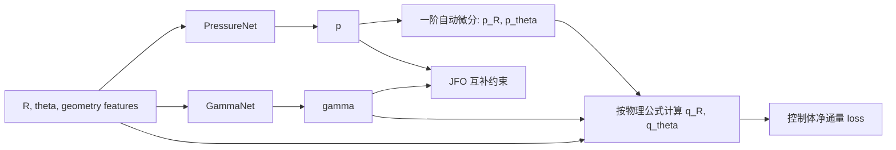
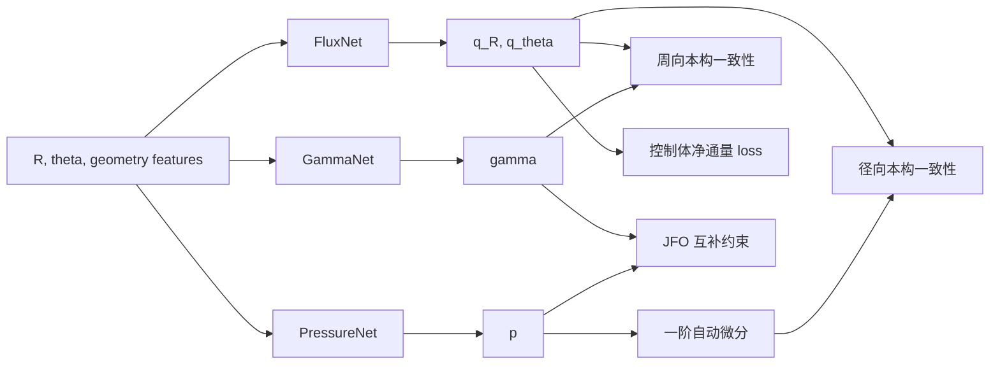

# 方案 A 数学原理、网络结构与训练目标详解

> 面向读者：了解神经网络和基本导数，但不要求熟悉偏微分方程、散度定理、混合有限元或约束优化。
>
> 本文目标：从当前 Reynolds-JFO 方程出发，一步一步解释为什么要使用通量和控制体，两个网络与三个网络分别在做什么，以及每条方程最终对应哪个训练目标。
>
> 新项目边界：只使用当前问题的物理参数和 FEM 结果做最终评价；不加载旧 PINN 权重，不使用旧模型伪标签，不复用旧共享主干和旧损失框架。

## 0. 先用一句话理解方案 A

旧 PINN 的训练方式是：

```text
在每一个采样点上，计算压力的二阶导数，
然后要求四个很大的数精确相加为零。
```

方案 A 的训练方式是：

```text
先根据压力、空化率和膜厚计算局部流量，
再检查每个小区域的总流入量是否等于总流出量。
```

两者描述的是同一个质量守恒方程，但第二种表达更接近有限体积法，也更适合存在尖锐膜厚变化和空化边界的问题。

方案 A 分成两个层级：

```text
A-min：PressureNet + GammaNet
       通量直接由 p、gamma 计算

A-mixed：PressureNet + GammaNet + FluxNet
         通量由 FluxNet 显式表示，
         再用本构方程约束它必须与 p、gamma 一致
```

实施顺序必须是先 A-min，后判断是否需要 A-mixed。不能一开始就默认第三个网络一定更好。

---

## 1. 当前问题中每个量是什么意思

### 1.1 坐标

当前计算域是一块环形扇区：

```text
R      ：径向坐标，从内径走向外径
theta  ：周向角度坐标
```

范围为：

```text
R in [R_i, R_o]
R_i = 47/52 = 0.9038461538
R_o = 1

theta in [0, 2*pi/6]
```

theta 区间长度是 60 度。这个扇区在周向上周期重复，所以：

```text
theta = 0
```

和

```text
theta = 2*pi/6
```

在物理上是同一条周期接缝。

### 1.2 未知场

我们真正要求解的主要未知量有两个：

```text
p(R,theta)      ：无量纲压力
gamma(R,theta)  ：空化率
```

gamma 的物理含义可以通过液相饱和度理解：

```text
s = 1-gamma
```

于是：

```text
gamma = 0  -> s = 1，局部完全充满液体
gamma = 0.3 -> s = 0.7，局部液相只占相应比例
gamma = 1  -> s = 0，极端情况下没有液相
```

因此 gamma 不只是“是不是空化”的分类标签。空化区内部 gamma 的大小也有物理意义。

### 1.3 已知场和参数

```text
H(R,theta) ：无量纲膜厚，由槽型几何决定，不是网络未知量
Lambda     ：运动输运相对于压力流动的强度
```

当前：

```text
H approximately in [1,4]
Lambda = 604.0794
```

因为 Reynolds 方程中出现 `H^3`，膜厚从 1 变到 4 会使系数从：

```text
1^3 = 1
```

变为：

```text
4^3 = 64
```

所以槽内外并不是轻微差异，而是最高约 64 倍的系数变化。

---

## 2. JFO 条件到底在限制什么

JFO 互补条件为：

```text
p >= 0
0 <= gamma <= 1
p*gamma = 0
```

前两个条件比较直观：

- 压力不能低于空化压力基准；
- 空化率必须在合理范围内。

第三个条件最重要：

```text
p*gamma = 0
```

一个乘积等于零，意味着两者至少有一个必须等于零。

因此每个位置只能处于下面的状态之一：

| 状态 | 压力 p | 空化率 gamma |
|---|---:|---:|
| 满膜区 | `p>0` | `gamma=0` |
| 空化区 | `p=0` | `gamma>0` |
| 空化边界 | `p=0` | `gamma=0` |

不允许出现：

```text
p>0 且 gamma>0
```

因为这意味着同一点既承受高于空化基准的液体压力，又被判断为液体不足。

这类条件称为“互补条件”。它会让求解区域自动分成不同活跃集，因此本问题本质上还包含一个未知的自由边界。

---

## 3. 原 Reynolds 方程

当前代码对应的方程为：

```text
1/R * d/dR(R H^3 p_R)
+ 1/R^2 * d/dtheta(H^3 p_theta)
- Lambda * d/dtheta[(1-gamma)H]
= 0
```

其中：

```text
p_R     = dp/dR
p_theta = dp/dtheta
```

可以把三部分粗略理解成：

```text
径向压力流动
+ 周向压力流动
- 表面运动带来的液相输运
= 0
```

等号右边为零表示没有凭空产生或消失的质量。

### 3.1 为什么旧写法需要压力二阶导数

第一项是：

```text
d/dR(R H^3 p_R)
```

里面已经包含一次压力导数 `p_R`，外面又对 R 求一次导数，所以最终包含：

```text
p_RR = d^2p/dR^2
```

第二项同理，包含：

```text
p_thetatheta = d^2p/dtheta^2
```

旧 PINN 直接把这些二阶导数放进每个点的 MSE 中。

### 3.2 为什么膜厚边缘让它更困难

展开周向压力项：

```text
d/dtheta(H^3 p_theta)
= H^3 p_thetatheta
  + 3 H^2 H_theta p_theta
```

它同时包含：

```text
压力二阶导数 p_thetatheta
膜厚导数 H_theta
压力一阶导数 p_theta
```

而膜厚驱动项还直接包含：

```text
-Lambda H_theta
```

当前窄 sigmoid 膜厚边缘使：

```text
Lambda*max|H_theta| approximately 21632
```

旧网络必须生成相应大小的压力导数或 gamma 导数，在每个点上与这个大项抵消。

---

## 4. 第一步改写：定义“通量”

### 4.1 通量的直观含义

通量可以理解为：

```text
单位边界上有多少东西正在穿过去
```

例如水管中：

```text
压力差 -> 产生水流量
```

在润滑膜中：

```text
压力梯度 + 表面运动 + 局部液相饱和度
-> 决定润滑剂流量
```

本文中的 `q_R`、`q_theta` 是无量纲方程中的广义通量。它们与物理质量流量成比例，但已经包含当前无量纲化和极坐标中的几何因子。

### 4.2 逐步推导，不跳步骤

从原方程开始：

```text
1/R * d/dR(R H^3 p_R)
+ 1/R^2 * d/dtheta(H^3 p_theta)
- Lambda * d/dtheta[(1-gamma)H]
= 0
```

方程两边同时乘以 R：

```text
d/dR(R H^3 p_R)
+ 1/R * d/dtheta(H^3 p_theta)
- Lambda R * d/dtheta[(1-gamma)H]
= 0
```

因为对 theta 求导时，R 是常数，所以：

```text
1/R * d/dtheta(H^3 p_theta)
= d/dtheta[(H^3/R)p_theta]
```

同样：

```text
Lambda R * d/dtheta[(1-gamma)H]
= d/dtheta[Lambda R(1-gamma)H]
```

因此方程可以写成：

```text
d/dR[R H^3 p_R]
+ d/dtheta[(H^3/R)p_theta - Lambda R(1-gamma)H]
= 0
```

现在定义：

```text
q_R = R H^3 p_R
```

以及：

```text
q_theta = (H^3/R)p_theta - Lambda R(1-gamma)H
```

方程就变成非常简单的形式：

```text
d(q_R)/dR + d(q_theta)/dtheta = 0
```

这一步没有近似，也没有改变物理方程。只是给两组很长的表达式起了名字。

### 4.3 两个通量分别包含什么

径向通量：

```text
q_R = R H^3 p_R
```

它主要由径向压力梯度产生。

周向通量：

```text
q_theta = (H^3/R)p_theta - Lambda R(1-gamma)H
```

包含两部分：

```text
q_theta_pressure = (H^3/R)p_theta
```

是周向压力驱动流量；

```text
q_theta_motion = -Lambda R(1-gamma)H
```

是表面运动携带液体产生的输运流量。

负号只是来自当前坐标和方程中的方向约定，不表示流量一定是“错误方向”。只要整个项目始终使用同一符号约定即可。

---

## 5. 第二步改写：从“点上导数为零”变成“小盒子流量守恒”

### 5.1 画一个控制体

在计算域中取一个小矩形：

```text
                 theta
                   ^
                   |
        top        q_theta
       +----------------+
       |                |
left   |   control      |   right
q_R    |    volume      |   q_R
       |                |
       +----------------+ --> R
        bottom      q_theta
```

它的边界为：

```text
R_left, R_right
theta_bottom, theta_top
```

如果盒子内部没有质量源，也没有质量汇，那么：

```text
总流入量 = 总流出量
```

或者：

```text
净流出量 = 0
```

### 5.2 四条边的净流量

右边减左边的径向净流量：

```text
int_theta [
    q_R(R_right,theta)
    - q_R(R_left,theta)
] dtheta
```

上边减下边的周向净流量：

```text
int_R [
    q_theta(R,theta_top)
    - q_theta(R,theta_bottom)
] dR
```

两者相加：

```text
F_cell =
int_theta [q_R(right)-q_R(left)] dtheta
+ int_R [q_theta(top)-q_theta(bottom)] dR
```

质量守恒要求：

```text
F_cell = 0
```

这就是控制体训练目标的数学来源。

### 5.3 为什么它与微分方程等价

微分方程：

```text
d(q_R)/dR + d(q_theta)/dtheta = 0
```

描述一个无限小位置附近的净流出率为零。

控制体方程：

```text
一个有限小盒子的总净流出量为零
```

后者是前者在一个小区域上的积分。只要场足够合理，控制体越来越小时，两者会对应到同一个守恒规律。

可以用银行账户类比：

```text
微分形式：检查每一瞬间余额变化率
控制体形式：检查一天内总收入减总支出
```

二者表达同一件事，但第二种对瞬间尖峰不那么敏感。

### 5.4 为什么不再需要显式计算 H_theta

控制体边界上只需要计算：

```text
q_R = R H^3 p_R
q_theta = H^3/R*p_theta - Lambda R(1-gamma)H
```

这里用到了：

```text
H 的值
p 的一阶导数
gamma 的值
```

但没有：

```text
H_theta
p_RR
p_thetatheta
```

因此膜厚从 1 快速变到 4 时，不会再显式制造 `Lambda*H_theta=21632` 的点态训练项。

这并不是忽略膜厚变化。膜厚仍然通过每条边上的 `H` 和 `H^3` 影响通量，只是不再对这个尖锐函数直接求导。

---

## 6. 方案 A-min：先不使用 FluxNet

### 6.1 网络结构

最小版本只使用两个独立网络：

```text
PressureNet -> p
GammaNet    -> gamma
```

结构流程：



PressureNet 和 GammaNet 不共享隐藏层。它们只通过物理通量和互补条件发生联系。

### 6.2 A-min 中通量不是网络输出

每次前向计算后，TensorFlow 做：

```text
p_R     = gradient(p,R)
p_theta = gradient(p,theta)
```

然后直接代入：

```text
q_R = R H^3 p_R
q_theta = H^3/R*p_theta - Lambda R(1-gamma)H
```

因此通量关系是代码中的精确公式，不需要额外 loss。

### 6.3 A-min 的优点

- 网络只有两个；
- 没有通量一致性 loss；
- 已经完全移除了压力二阶导数；
- 已经完全移除了显式 H 导数；
- 最容易判断“控制体 formulation 本身是否有效”。

### 6.4 A-min 的潜在缺点

- 控制体边界上的 q 完全依赖 PressureNet 的一阶导数；
- 如果 p 的导数噪声很大，控制体积分也会抖动；
- 当 H 非常尖锐时，`H^3 p_R` 或 `H^3 p_theta` 可能难以由一个全局光滑 PressureNet 表示；
- 无法单独给通量更多表达能力。

这些缺点只有在实际 A-min 实验中出现时，才构成加入 FluxNet 的理由。

---

## 7. 方案 A-mixed：加入 FluxNet

### 7.1 FluxNet 是什么

FluxNet 输出：

```text
q_R_network
q_theta_network
```

它不是第三种相，也不是第三个独立物理规律。它只是把原本由公式计算的通量，改成一个显式待求场。

完整结构：



### 7.2 为什么 FluxNet 不能随便编造通量

FluxNet 必须满足径向本构关系：

```text
r_R = q_R_network - R H^3 p_R
```

训练要求：

```text
r_R = 0
```

周向本构关系：

```text
r_theta = q_theta_network
          - H^3/R*p_theta
          + Lambda R(1-gamma)H
```

训练要求：

```text
r_theta = 0
```

同时 FluxNet 还必须满足每个控制体：

```text
F_cell(q_network) = 0
```

所以它必须同时做到：

```text
通量与 p、gamma 的物理公式一致
并且通量自身质量守恒
```

如果 FluxNet 编造一个散度为零但与压力无关的通量，控制体 loss 可能很小，但本构 loss 会很大。

如果它与压力公式一致但不守恒，本构 loss 可能很小，但控制体 loss 会很大。

### 7.3 A-mixed 的作用

它相当于让网络分别学习：

```text
状态量：p、gamma
守恒量：q_R、q_theta
```

这与混合有限元中同时求解状态和通量的思想相似。

可能的收益：

- 可以直接提高通量网络的表达能力；
- 控制体积分不再直接使用 PressureNet 的导数噪声；
- 可以单独监测通量误差和通量连续性；
- 在 H 系数跳变附近，优先让守恒量达到正确状态。

代价：

- 多一个网络；
- 多两个本构残差；
- 多一组尺度和训练诊断；
- 如果 loss 归一化错误，会重新产生多目标失衡。

### 7.4 什么时候才升级到 A-mixed

满足以下任一现象时再增加 FluxNet：

1. A-min 的 PressureNet 场看起来平滑，但一阶导数噪声很大。
2. 控制体平均误差能下降，P99 长期不下降。
3. 跨槽边缘的法向通量出现明显跳变。
4. 减小 H 平滑宽度后 A-min 明显失稳。
5. 多个随机种子的质量流量误差差异很大。

如果 A-min 已经稳定且精度满足要求，不加入 FluxNet。

---

## 8. 输入特征和网络主干

### 8.1 为什么不能简单输入原始 theta

计算域在 theta 方向周期重复。原始标量：

```text
theta=0
theta=2*pi/6
```

数值不同，但物理位置相同。

如果直接把 theta 输入普通 MLP，网络必须额外学习这两个端点应该相等。

使用固定 Fourier 特征：

```text
sin(n*K*theta)
cos(n*K*theta)
```

其中：

```text
K=6
n=1,2,...,N_fourier
```

因为：

```text
sin[n*K*(theta+2*pi/K)] = sin(n*K*theta)
cos[n*K*(theta+2*pi/K)] = cos(n*K*theta)
```

所以周期性由输入结构自动满足，不需要网络用 loss 猜出来。

### 8.2 径向归一化

定义：

```text
rho = 2*(R-R_i)/(R_o-R_i)-1
```

于是：

```text
R=R_i -> rho=-1
R=R_o -> rho=1
```

这比直接输入约 `0.9到1.0` 的窄区间更适合神经网络。

### 8.3 geometry features 是什么

geometry features 是完全由已知槽型计算的输入，例如：

```text
H(R,theta)
到槽入口边缘的平滑距离
到槽出口边缘的平滑距离
到径向纹理边缘的距离
```

它们不是旧模型输出，也不是 FEM 标签。

第一版可使用：

```text
rho
sin/cos Fourier features
smooth H
```

不要一开始输入大量手工特征。只有当误差稳定集中在某类几何边缘时，再加入对应的距离特征。

### 8.4 主干建议

A-min 第一版：

```text
PressureNet:
  fixed input embedding
  4 x Dense(128)
  SiLU
  scalar latent z_p

GammaNet:
  fixed input embedding
  4 x Dense(128)
  SiLU
  scalar latent z_gamma
```

A-mixed 新增：

```text
FluxNet:
  fixed input embedding
  4 x Dense(128)
  SiLU
  two outputs z_qR, z_qTheta
```

三个网络不共享隐藏层，不使用旧 Coslayer，不使用普通直接相加 residual。

首轮使用 float64，因为本问题包含高系数对比和通量相消。float32 可在 formulation 稳定后作为速度消融，而不是默认精度。

---

## 9. 如何让输出天然满足范围和边界

### 9.1 径向坐标和距离函数

定义：

```text
t = (R-R_i)/(R_o-R_i)
```

所以：

```text
R=R_i -> t=0
R=R_o -> t=1
```

再定义固定距离形状：

```text
D(R) = 4*t*(1-t)
```

它满足：

```text
D(R_i)=0
D(R_o)=0
0<=D<=1
```

它不是神经网络，不包含可训练参数。

### 9.2 压力非负和径向边界

定义带参数 beta 的 softplus：

```text
SP_beta(x) = log(1+exp(beta*x))/beta
```

它总是大于零，并且在 x 较大时接近 x。

它的反函数为：

```text
SP_beta_inverse(y)
= log(exp(beta*y)-1)/beta
```

先把边界压力转换到 latent 空间：

```text
a_i = SP_beta_inverse(P_i)
a_o = SP_beta_inverse(P_o)
```

构造边界插值：

```text
a_bc(R) = (1-t)*a_i + t*a_o
```

最终压力为：

```text
p(R,theta)
= SP_beta[a_bc(R) + D(R)*z_p(R,theta)]
```

检查内边界：

```text
R=R_i
D=0
p=SP_beta(a_i)=P_i
```

检查外边界：

```text
R=R_o
D=0
p=SP_beta(a_o)=P_o
```

因此压力边界由结构严格满足，不需要边界 MSE。

在内部，`z_p` 可以很负，使 p 接近零，从而表示空化区。

注意：softplus 在有限输入下只能接近零，不能数学上严格等于零。方案 A 使用平滑互补 continuation 与它配合；如果最终必须得到显式零压力区域，方案 B 的 active-set 结构更合适。

### 9.3 gamma 的范围和边界

使用：

```text
gamma = D(R)*sigmoid(z_gamma)
```

于是：

```text
0<=gamma<=1
gamma(R_i)=gamma(R_o)=0
```

这表示两个径向给定压力边界处保持满膜。

如果以后确认真实物理边界只要求其中一侧 gamma 为零，应修改这个固定变换，而不是增加一个相互竞争的边界 loss。

---

## 10. 为什么要给方程做固定尺度归一化

### 10.1 归一化不是修改物理

假设一个方程残差通常是：

```text
r_1 approximately 10000
```

另一个通常是：

```text
r_2 approximately 0.01
```

直接平方后：

```text
r_1^2 approximately 1e8
r_2^2 approximately 1e-4
```

优化器几乎只看到第一个。

如果我们提前知道它们各自的物理尺度：

```text
S_1=10000
S_2=0.01
```

使用：

```text
rhat_1=r_1/S_1
rhat_2=r_2/S_2
```

那么二者都在约 O(1) 范围。

方程 `r=0` 与 `r/S=0` 的解完全相同，只是优化坐标更合理。

### 10.2 固定参考量

定义：

```text
Delta_R = R_o-R_i
Delta_theta = 2*pi/6
R_ref = (R_i+R_o)/2
P_ref = max(P_i,P_o)
H_ref = geometry 中预先声明的中位数或 RMS
```

径向压力通量尺度：

```text
S_qR = R_ref*H_ref^3*P_ref/Delta_R
```

周向压力流量尺度：

```text
S_qTheta_pressure
= H_ref^3*P_ref/(R_ref*Delta_theta)
```

周向运动输运尺度：

```text
S_qTheta_motion
= Lambda*R_ref*H_ref
```

总周向尺度：

```text
S_qTheta
= S_qTheta_pressure + S_qTheta_motion
```

这些值在训练开始前计算一次，写入配置和日志，训练中不随 batch 改变。

### 10.3 控制体残差尺度

对于宽度为：

```text
Delta_R_cell
Delta_theta_cell
```

的控制体，净通量特征尺度可取：

```text
S_cell
= S_qR*Delta_theta_cell
  + S_qTheta*Delta_R_cell
```

归一化控制体残差：

```text
r_CV = F_cell/S_cell
```

控制体 loss：

```text
L_CV = mean(r_CV^2)
```

---

## 11. A-min 的完整训练目标

### 11.1 质量守恒目标

由于 A-min 的通量由物理公式直接计算，所以主要 PDE 目标只有：

```text
L_CV = mean[(F_cell/S_cell)^2]
```

每个控制体的边界积分用固定 Gauss-Legendre 积分点计算。第一版建议每条边 3 或 4 个积分点。

### 11.2 互补约束

先缩放压力：

```text
p_bar = p/P_ref
g_bar = gamma
```

定义平滑 Fischer-Burmeister 约束：

```text
c_FB
= p_bar + g_bar
  - sqrt(p_bar^2 + g_bar^2 + epsilon_FB^2)
```

当：

```text
epsilon_FB -> 0
```

且：

```text
p_bar>=0, g_bar>=0
```

时，`c_FB=0` 等价于：

```text
p_bar*g_bar=0
```

### 11.3 为什么不再直接写固定 FB 权重

旧方式类似：

```text
Loss = L_CV + 1000*L_FB
```

但 `1000` 是否合适会随着训练阶段变化。

方案 A 使用增广拉格朗日：

```text
J_AL
= L_CV
  + mean(lambda_i*c_FB_i)
  + mu/2*mean(c_FB_i^2)
```

其中：

```text
lambda_i ：每个固定约束点的乘子
mu       ：约束罚参数
```

每个外层训练周期后更新：

```text
lambda_i <- lambda_i + mu*c_FB_i
```

直观类比：

```text
固定罚权重：所有违规行为永远只罚同样金额

增广拉格朗日：
某个位置持续违规，监督信号会在该位置累积，
不需要一开始就把所有罚款设得极大
```

只有当整体约束下降停滞时，才提高 mu。

### 11.4 A-min 最终目标

```text
minimize over PressureNet, GammaNet:

J_Amin
= L_CV
  + mean(lambda*c_FB)
  + mu/2*mean(c_FB^2)
```

注意：

- 压力边界不在 loss 中，因为输出结构已经满足；
- gamma 范围不在 loss 中，因为 sigmoid 已经满足；
- theta 周期性不在 loss 中，因为 Fourier 输入已经满足；
- 不再默认加入 `mean((p*gamma)^2)`；
- `p*gamma` 只作为监测指标。

---

## 12. A-mixed 的完整训练目标

### 12.1 FluxNet 输出尺度

FluxNet 输出无量纲 latent：

```text
z_qR
z_qTheta
```

恢复通量：

```text
q_R_network = S_qR*z_qR
q_theta_network = S_qTheta*z_qTheta
```

### 12.2 径向本构 loss

```text
rhat_R
= [q_R_network - R H^3 p_R]/S_qR
```

```text
L_const_R = mean(rhat_R^2)
```

### 12.3 周向本构 loss

```text
rhat_theta
= [q_theta_network
   - H^3/R*p_theta
   + Lambda R(1-gamma)H]
   /S_qTheta
```

```text
L_const_theta = mean(rhat_theta^2)
```

### 12.4 控制体 loss

控制体边界积分直接使用 FluxNet 输出：

```text
L_CV = mean[(F_cell(q_network)/S_cell)^2]
```

### 12.5 A-mixed 最终目标

```text
L_phys
= L_const_R
  + L_const_theta
  + L_CV
```

增广拉格朗日目标：

```text
J_Amixed
= L_phys
  + mean(lambda*c_FB)
  + mu/2*mean(c_FB^2)
```

所有物理残差都已经按固定特征尺度归一化，所以第一版使用系数 1：

```text
1*L_const_R
+1*L_const_theta
+1*L_CV
```

如果某项明显失衡，应先检查尺度定义、积分方向和代码错误，而不是立刻加入新的自适应权重算法。

---

## 13. 方程、网络和训练目标的一一对应

### 13.1 A-min

| 物理要求 | 如何实现 | 是否有 loss |
|---|---|---:|
| `p(R_i)=P_i` | 压力硬输出变换 | 否 |
| `p(R_o)=P_o` | 压力硬输出变换 | 否 |
| `p>=0` | softplus | 否 |
| `0<=gamma<=1` | sigmoid 与固定 D | 否 |
| theta 周期 | 固定 Fourier 特征 | 否 |
| `q_R=RH^3p_R` | 直接公式计算 | 否 |
| `q_theta=...` | 直接公式计算 | 否 |
| 质量守恒 | 控制体净通量 | `L_CV` |
| `p*gamma=0` | AL-FB 约束 | `J_AL` |

### 13.2 A-mixed

| 物理要求 | 如何实现 | 是否有 loss |
|---|---|---:|
| 压力边界和非负 | 压力硬输出变换 | 否 |
| gamma 范围和边界 | gamma 硬输出变换 | 否 |
| theta 周期 | 固定 Fourier 特征 | 否 |
| `q_R=RH^3p_R` | FluxNet 与压力的一致性 | `L_const_R` |
| `q_theta=...` | FluxNet 与 p、gamma 一致性 | `L_const_theta` |
| 质量守恒 | FluxNet 控制体净通量 | `L_CV` |
| `p*gamma=0` | AL-FB 约束 | `J_AL` |

这张表是实现时最重要的检查表。任何新增 loss 都必须先回答：它对应哪一条尚未被满足的物理要求？如果回答不出来，就不应该加入。

---

## 14. 训练为什么要分阶段

真实问题同时包含：

```text
大 Lambda
尖锐 H
空化自由边界
互补约束
周期几何
```

随机初始化后一次性打开所有难度，相当于让网络同时寻找压力、gamma、相区边界和巨大通量之间的平衡。

continuation 的思想是：

```text
先解容易但相近的问题
再一点一点移动到真实问题
```

这不是使用旧模型，而是同一个新模型沿物理参数连续训练。

### 14.1 阶段 S0：制造解和符号测试

在正式几何前必须完成：

1. 常数 H 制造解。
2. 单独验证 q_R 的符号。
3. 单独验证 q_theta 的符号。
4. 对人工散度为零的 q 检查 `L_CV` 接近机器精度。
5. 检查周期 seam 控制体正确连接。
6. 检查压力硬边界在随机权重下也严格成立。

如果这些测试没有通过，不允许开始长训练。

### 14.2 阶段 S1：低驱动满膜问题

```text
Lambda_train = 0.1*Lambda_true
gamma fixed to 0
H smoothing width = 4*xi_true
```

训练目标：

```text
只让压力产生守恒通量
确认 L_CV 可以稳定下降
```

此阶段没有自由边界。

### 14.3 阶段 S2：逐步提高 Lambda，并开放 gamma

建议：

```text
Lambda ratio: 0.1 -> 0.25 -> 0.5 -> 0.75 -> 1.0
```

不能一直把 gamma 固定到真实 Lambda。如果满膜压力开始接近空化压力、控制体误差无法继续下降，就应开放 GammaNet 和互补约束。

一个保守顺序是：

```text
0.1 Lambda：gamma fixed 0
0.25 Lambda：开放 gamma，epsilon_FB 较大
0.5及以上：联合训练 p、gamma
```

具体空化成核点由试验确定，但必须记录在配置中。

### 14.4 阶段 S3：互补约束 continuation

先使用较平滑的 FB：

```text
epsilon_FB = 1e-2
```

当质量守恒和互补约束都稳定后逐步降低：

```text
1e-2 -> 1e-3 -> 1e-4 -> 1e-5
```

每降低一级前必须检查：

```text
L_CV 没有恶化一个数量级以上
FB P99 正在下降
gamma 没有塌缩为全零或全一
p 没有大面积错误贴零
```

### 14.5 阶段 S4：锐化膜厚

```text
xi ratio: 4 -> 2 -> 1
```

每次减少 xi 后，H 的边缘更接近真实槽型。

虽然控制体方法不直接计算 H_theta，但更尖锐的 H 仍会使压力梯度和通量更难表示，所以仍然需要逐步推进。

### 14.6 阶段 S5：Adam 后接 L-BFGS

Adam 用于前期寻找合理解区域。

当：

```text
Lambda 已真实
xi 已真实
控制体和约束点已固定
```

后，使用 full-batch L-BFGS 做后期收敛。

原因不是 L-BFGS 神奇，而是它会利用历史曲率信息，对病态方向进行近似预条件化。旧项目长时间纯 Adam 的反弹已经说明只依赖一阶优化器不够可靠。

---

## 15. 每个训练循环实际做什么

### 15.1 A-min 伪代码

```text
for each continuation stage:
    set Lambda_train, xi_train, epsilon_FB

    for each AL outer iteration:
        for Adam steps:
            sample or load fixed control volumes

            p = PressureNet with hard transform
            gamma = GammaNet with hard transform

            p_R, p_theta = first-order autodiff(p)

            q_R = R*H^3*p_R
            q_theta = H^3/R*p_theta
                      - Lambda*R*(1-gamma)*H

            L_CV = control_volume_flux_balance(q_R,q_theta)
            c_FB = complementarity(p,gamma,epsilon_FB)

            J = L_CV
                + mean(lambda*c_FB)
                + mu/2*mean(c_FB^2)

            update PressureNet and GammaNet

        lambda = lambda + mu*c_FB

        if constraint stagnates:
            increase mu conservatively

    run fixed validation
    save feasible best checkpoint
```

### 15.2 A-mixed 伪代码

```text
for each continuation stage:
    for each AL outer iteration:
        for optimizer steps:
            p = PressureNet(...)
            gamma = GammaNet(...)
            q_R_net, q_theta_net = FluxNet(...)

            p_R, p_theta = first-order autodiff(p)

            L_const_R = consistency(
                q_R_net,
                R*H^3*p_R
            )

            L_const_theta = consistency(
                q_theta_net,
                H^3/R*p_theta
                - Lambda*R*(1-gamma)*H
            )

            L_CV = control_volume_flux_balance(
                q_R_net,
                q_theta_net
            )

            J_phys = L_const_R + L_const_theta + L_CV
            J = J_phys + augmented_lagrangian_FB

            update all three networks

        update AL multipliers
```

---

## 16. 控制体和采样点怎么布置

### 16.1 控制体不是随机散点

旧强形式 PINN 主要在随机点检查 PDE。

控制体方法需要一组有明确边界的小区域。建议先使用结构化控制体网格：

```text
R 方向 N_R 个单元
theta 方向 N_theta 个单元
```

每个单元都有固定：

```text
left/right/top/bottom
```

这样更容易验证符号和全局质量平衡。

### 16.2 H 边缘附近加密

膜厚边缘附近通量变化快，需要更小控制体。

建议分配：

```text
40% 均匀区域
25% H/槽边缘邻域
20% 当前空化过渡带
10% 径向边界邻域
 5% 周期 seam 检查
```

第一版不要每个 step 完全随机改变控制体。固定或分阶段固定控制体更适合 AL 乘子和 L-BFGS。

### 16.3 周期接缝

theta 顶部超出：

```text
2*pi/6
```

时，应回到：

```text
0
```

跨 seam 控制体的上、下边必须使用周期映射，不能把 seam 当成真实封闭边界。

---

## 17. best checkpoint 怎么选

不能再只比较一个 total loss。

固定验证集至少保存：

```text
CV residual mean
CV residual P99
global net mass flux
FB residual mean
FB residual P99
max(p*gamma)
pressure radial BC error
theta periodic value error
theta periodic flux error
```

对于 A-mixed 还要保存：

```text
radial constitutive residual mean/P99
theta constitutive residual mean/P99
```

best 判断顺序：

1. 硬边界和周期检查必须通过。
2. 全局质量不平衡必须低于阈值。
3. 比较控制体 P99，而不是只比较 mean。
4. 比较互补 P99 和 `max(p*gamma)`。
5. A-mixed 再比较两个本构残差。
6. 前面都近似相同时，才比较总平均误差。

FEM 的压力 L2、gamma L2 和 IoU 只用于训练后的后验评价，不参与 best 选择。

---

## 18. 如何判断方案 A 是否真的成功

### 18.1 第一层成功：数学和实现正确

```text
制造解通过
控制体符号正确
周期 seam 正确
硬边界达到 float64 精度
全局净通量与所有控制体之和一致
```

### 18.2 第二层成功：优化稳定

```text
L_CV 整体下降而不是长期大幅反弹
不同 seed 的结果接近
降低 epsilon_FB 后互补误差继续下降
锐化 H 后不出现 NaN 或整体崩溃
```

### 18.3 第三层成功：物理结果改善

```text
压力相对 L2 优于或至少稳定达到旧 SiLU 基线
gamma 相对 L2 明显改善
多阈值 IoU 不再高度敏感
全局质量流量误差优于旧强形式模型
空化边界位置稳定
```

不能只用“raw loss 是否达到 1e-6”判断。新旧残差定义已经不同，raw 数值没有直接可比性。

---

## 19. 常见疑问

### 19.1 这还是 PINN 吗

是。

因为：

- 未知场仍由神经网络表示；
- 训练信号仍然来自 Reynolds 方程、质量守恒和 JFO 条件；
- FEM 不参与训练；
- 没有监督标签拟合。

变化只是从“点态强形式 PINN”改成“控制体/混合形式 PINN”。

### 19.2 控制体是不是偷偷用了传统有限体积法

它借用了有限体积法的守恒思想和积分形式，但未知场仍然是连续神经网络，不是每个网格单元一个离散未知数。

控制体在这里负责生成物理训练残差，而不是直接组成传统线性方程组。

### 19.3 不计算 H_theta，是不是忽略槽边缘

不是。

槽边缘仍通过边界上的：

```text
H
H^3
```

改变通量。我们只是不用点态导数描述这个变化，而用小区域两侧流量差描述它。

### 19.4 为什么 A-min 可能已经够用

因为控制体本身已经移除了两个最大问题：

```text
压力二阶自动微分
显式膜厚导数
```

FluxNet 解决的是进一步的通量表示和导数噪声问题，不应在还没有证据时提前加入。

### 19.5 为什么不继续使用 p*gamma loss

它只能惩罚重叠：

```text
p>0 且 gamma>0
```

但当其中一个变量已经很小时，它给另一个变量的梯度也很小，不能可靠决定应该进入哪个相区。

AL-FB 把互补关系作为逐点约束处理，更适合当前问题。

### 19.6 为什么还需要 epsilon_FB

原始 FB 函数在：

```text
p=0, gamma=0
```

附近不够光滑，而空化边界恰好经过这个点。

先使用较大 epsilon 相当于把尖角暂时磨圆，待网络找到正确相区后再逐步减小。

### 19.7 如果 A-min 仍然失败怎么办

按以下顺序定位：

1. 制造解和符号测试是否通过。
2. 常数 H、gamma=0 是否能训练。
3. 真实 H、低 Lambda 是否能训练。
4. 控制体 P99 是否只在 H 边缘失败。
5. 压力一阶导数是否噪声过大。
6. 若前四项正确且第五项明显，才加入 FluxNet。
7. 若通量稳定但 gamma 界面仍失败，才考虑方案 B 的显式自由边界。

---

## 20. 推荐实施决策

第一阶段只实现 A-min：

```text
PressureNet
GammaNet
固定 Fourier 周期输入
固定硬边界输出
一阶压力导数
直接通量公式
控制体质量守恒
AL-FB 互补约束
物理 continuation
Adam + L-BFGS
```

第一阶段不实现：

```text
FluxNet
普通 residual skip
PirateNet
动态 loss 权重
自适应随机控制体
旧模型 teacher
FEM 监督
```

只有 A-min 的诊断证明问题集中在通量表示或压力导数噪声时，才升级到 A-mixed：

```text
新增 FluxNet
新增两个归一化本构残差
控制体直接使用 FluxNet 通量
```

这条实施顺序的核心不是追求最复杂的架构，而是确保每次升级都有明确证据：

```text
先证明方程表达改对了，
再决定是否需要增加通量自由度，
最后才处理显式自由边界。
```

---

## 21. 最简公式总表

### 原方程

```text
1/R*d_R(RH^3p_R)
+1/R^2*d_theta(H^3p_theta)
-Lambda*d_theta[(1-gamma)H]
=0
```

### 通量定义

```text
q_R = RH^3p_R
q_theta = H^3/R*p_theta - Lambda*R*(1-gamma)*H
```

### 守恒方程

```text
d_R(q_R)+d_theta(q_theta)=0
```

### 控制体方程

```text
int_theta[q_R(right)-q_R(left)]dtheta
+int_R[q_theta(top)-q_theta(bottom)]dR
=0
```

### JFO 条件

```text
p>=0
0<=gamma<=1
p*gamma=0
```

### A-min 训练目标

```text
J_Amin
= L_CV
  + mean(lambda*c_FB)
  + mu/2*mean(c_FB^2)
```

### A-mixed 训练目标

```text
J_Amixed
= L_const_R
  + L_const_theta
  + L_CV
  + mean(lambda*c_FB)
  + mu/2*mean(c_FB^2)
```

### 实施顺序

```text
A-min
-> 验证通量和控制体 formulation
-> 有证据时增加 FluxNet
-> gamma 自由边界仍是瓶颈时进入方案 B
```

## 参考资料

- [FO-PINN: A First-Order formulation for Physics-Informed Neural Networks](https://www.sciencedirect.com/science/article/pii/S0955799725000499)
- [Mixed formulation PINNs for heterogeneous domains](https://onlinelibrary.wiley.com/doi/full/10.1002/nme.7388)
- [Control-volume PINNs for conservation laws](https://www.sciencedirect.com/science/article/pii/S0021999121006495)
- [Physics and Equality Constrained Artificial Neural Networks](https://arxiv.org/abs/2109.14860)
- [Mass-conserving cavitation PINNs with soft and hard constraints](https://www.sciopen.com/article/10.1007/s40544-023-0791-1)
